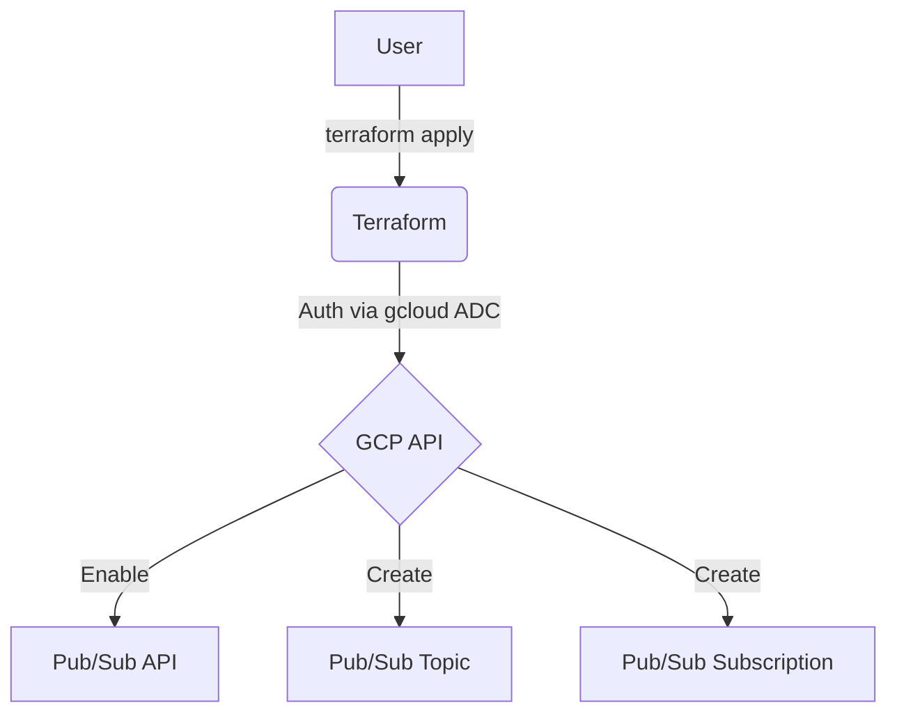
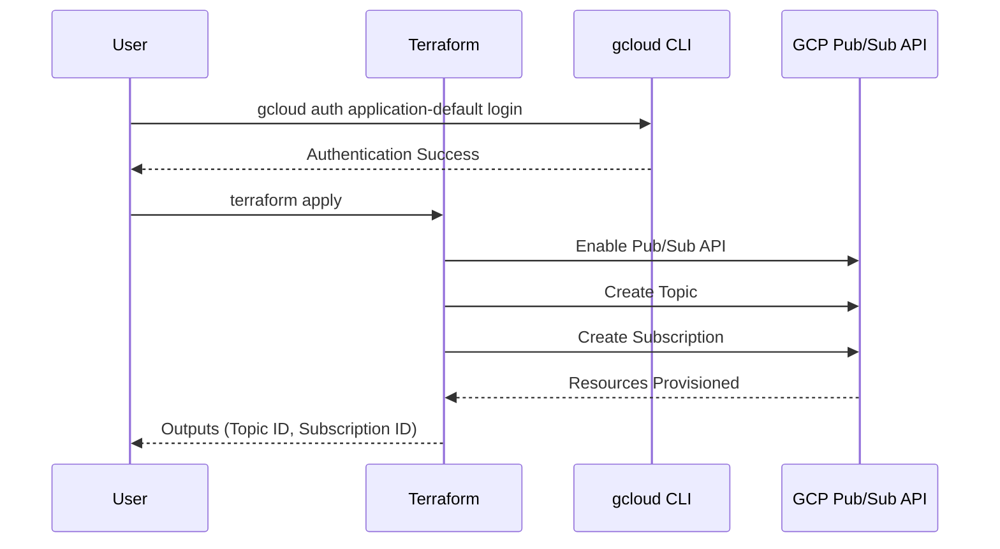

# terraform-gcp-pubsub

This Terraform project provisions a Google Pub/Sub topic and subscription for asynchronous messaging.

## Architecture

### Flowchart


### Sequence Diagram


## Specifications
- **Topic**: Configurable message retention, labels.
- **Subscription**: Supports both push and pull delivery, configurable retry and expiry policies.

## Prerequisites
1.  **Google Cloud SDK**: [Installed and initialized](https://cloud.google.com/sdk/docs/install).
2.  **Terraform**: [Installed](https://developer.hashicorp.com/terraform/downloads).

## Setup & Deployment

1.  **Authenticate and Select Project**:
    ```bash
    gcloud auth application-default login
    gcloud config set project your-project-id
    ```

2.  **Configure Variables**:
    Create a `terraform.tfvars` file based on the example:
    ```hcl
    project_id   = "your-project-id"
    region       = "us-central1"
    topic_name   = "my-topic"
    subscription_name = "my-subscription"
    ```

3.  **Deploy**:
    ```bash
    terraform init
    terraform apply
    ```

## Usage in Node.js (TypeScript)

After deployment, use the Pub/Sub topic and subscription in a Node.js/TypeScript application.

### Install

```bash
npm install @google-cloud/pubsub
```

### Publish Messages

```typescript
import { PubSub } from '@google-cloud/pubsub';

const pubsub = new PubSub();
const topicName = 'my-topic'; // or use module output topic_name

async function publishMessage(data: object): Promise<string> {
  const topic = pubsub.topic(topicName);
  const messageBuffer = Buffer.from(JSON.stringify(data));
  const messageId = await topic.publish(messageBuffer);
  console.log(`Message published: ${messageId}`);
  return messageId;
}

// Example usage
publishMessage({ orderId: '123', userId: 'abc', amount: 49.99 });
```

### Subscribe and Acknowledge Messages

```typescript
import { PubSub, Message } from '@google-cloud/pubsub';

const pubsub = new PubSub();
const subscriptionName = 'my-subscription'; // or use module output subscription_name

function listenForMessages(): void {
  const subscription = pubsub.subscription(subscriptionName);

  const messageHandler = (message: Message) => {
    console.log(`Received message ${message.id}:`);
    console.log(`Data: ${message.data.toString()}`);
    console.log(`Attributes:`, message.attributes);

    // Acknowledge the message so it won't be redelivered
    message.ack();
  };

  subscription.on('message', messageHandler);
  console.log(`Listening for messages on ${subscriptionName}...`);
}

listenForMessages();
```

### Auth

The client automatically uses Application Default Credentials (ADC) from your environment:
- Local dev: `gcloud auth application-default login`
- GCP services (Cloud Run, GKE, Compute Engine): uses the attached service account

Set the `GOOGLE_CLOUD_PROJECT` environment variable or configure the project ID:
```typescript
const pubsub = new PubSub({ projectId: 'your-project-id' });
```

### Other Languages

The same pattern applies across all Google Cloud client libraries:

| Language | Package | Publisher Example |
|----------|---------|------------------|
| **Python** | `google-cloud-pubsub` | `publisher.publish(topic_path, data.encode())` |
| **Java** | `com.google.cloud:google-cloud-pubsub` | `publisher.publish(PubsubMessage.newBuilder().setData(data).build())` |
| **Go** | `cloud.google.com/go/pubsub` | `topic.Publish(ctx, &pubsub.Message{Data: data})` |
| **C#** | `Google.Cloud.PubSub.V1` | `publisher.Publish(topicName, new PubsubMessage{ Data = data })` |
| **Ruby** | `google-cloud-pubsub` | `topic.publish(data)` |
| **PHP** | `google/cloud-pubsub` | `topic->publish(['data' => $data])` |

## Usage as a Module

> **Option 1**: Terraform Registry (recommended)
> ```hcl
> module "pubsub" {
>   source  = "marcuwynu23/pubsub/gcp"
>   version = "1.0.0"
>
>   project_id        = var.project_id
>   region            = "us-central1"
>   topic_name        = "orders-topic"
>   subscription_name = "orders-subscription"
> }
> ```
>
> **Option 2**: GitHub source
> ```hcl
> module "pubsub" {
>   source = "github.com/marcuwynu23/terraform-gcp-pubsub?ref=main"
>
>   project_id        = var.project_id
>   region            = "us-central1"
>   topic_name        = "orders-topic"
>   subscription_name = "orders-subscription"
> }
> ```

## Variables

| Variable | Description | Type | Default |
|----------|-------------|------|---------|
| `project_id` | GCP project ID | `string` | (required) |
| `region` | GCP region (free tier: us-west1, us-central1, us-east1) | `string` | `"us-central1"` |
| `topic_name` | Pub/Sub topic name | `string` | `"my-topic"` |
| `message_retention_duration` | Message retention duration | `string` | `"86600s"` |
| `labels` | Topic labels | `map(string)` | `{}` |
| `subscription_name` | Subscription name | `string` | `"my-subscription"` |
| `ack_deadline_seconds` | Acknowledgement deadline | `number` | `20` |
| `push_endpoint` | Push endpoint (empty for pull) | `string` | `""` |
| `expiration_ttl` | Subscription expiration TTL | `string` | `"86400s"` |
| `min_retry_backoff` | Minimum retry backoff | `string` | `"10s"` |
| `max_retry_backoff` | Maximum retry backoff | `string` | `"600s"` |
| `enable_message_ordering` | Enable message ordering | `bool` | `false` |

## Outputs

| Output | Description |
|--------|-------------|
| `topic_id` | The ID of the Pub/Sub topic |
| `topic_name` | The name of the Pub/Sub topic |
| `subscription_id` | The ID of the subscription |
| `subscription_name` | The name of the subscription |

## Resources Created

- `google_project_service.pubsub_api` – Enables Pub/Sub API
- `google_pubsub_topic.topic` – Pub/Sub topic for message ingestion
- `google_pubsub_subscription.subscription` – Pub/Sub subscription (push or pull)
## CI/CD Setup (GitHub Actions)

### Prerequisites
1. **Create a GCS bucket** for Terraform remote state:
    ```bash
    gcloud storage buckets create gs://your-terraform-state-bucket \
      --location=us-central1 \
      --uniform-bucket-level-access
    ```

2. **Create a service account** with necessary permissions and generate a JSON key:
    - GCP Console → IAM & Admin → Service Accounts → Create Service Account
    - Grant the required roles for this module
    - Keys → Add Key → Create New Key → JSON
    - Copy the entire JSON file contents

3. **Add GitHub secrets**:

    | Secret Name | Value |
    |---|---|
    | `GCP_SA_KEY` | Full JSON key from step 2 |
    | `TF_BUCKET_NAME` | Your GCS bucket name |
    | `TF_BUCKET_PREFIX` | Bucket prefix/path (e.g., `gcp-pubsub`) |

4. **Run the workflow**:
    - **Apply**: Go to Actions → **CD - GCP Pub/Sub (Apply)** → fill in all inputs
    - **Destroy**: Go to Actions → **CD - GCP Pub/Sub (Destroy)** → fill in essential inputs

> Alternatively, create a `backend.tfvars` from `backend.tfvars.example` and run `terraform init -backend-config="backend.tfvars"` for local use.

## Remote State (GCS Backend)

This module uses Google Cloud Storage (GCS) as the Terraform backend for remote state management:

```hcl
terraform {
  backend "gcs" {
    bucket = "your-terraform-state-bucket"
    prefix = "gcp-pubsub"
  }
}
```

Create a `backend.tfvars` file based on `backend.tfvars.example` and initialize:

```bash
terraform init -backend-config="backend.tfvars"
```

